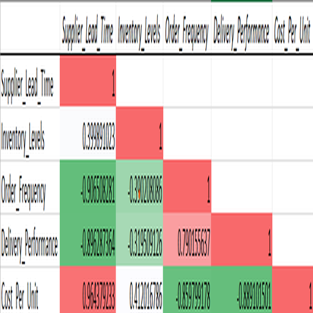

# Supply Chain Correlation Analysis

**Email:** 23f1002151@ds.study.iitm.ac.in

This repository contains the correlation analysis and visualization for the Supply Chain dataset.

---

## Files in this Repository

- [correlation.csv](./correlation.csv) → Correlation matrix generated using Excel Data Analysis ToolPak
- [heatmap.png](./heatmap.png) → Heatmap of the correlation matrix using Excel conditional formatting (Red–White–Green color scale)
- [README.md](./README.md) → Project details and validation email

---

## Correlation Heatmap Preview

---

## Steps Performed

1. **Generated Correlation Matrix**

   - Used Excel’s _Data Analysis ToolPak → Correlation_
   - Selected 5 data columns with labels in the first row

2. **Applied Conditional Formatting**

   - `Home → Conditional Formatting → Color Scales → Red–White–Green`
   - Cropped screenshot saved as `heatmap.png` (400–512px dimensions)

3. **Exported Correlation Matrix**
   - Saved as `correlation.csv`

---
